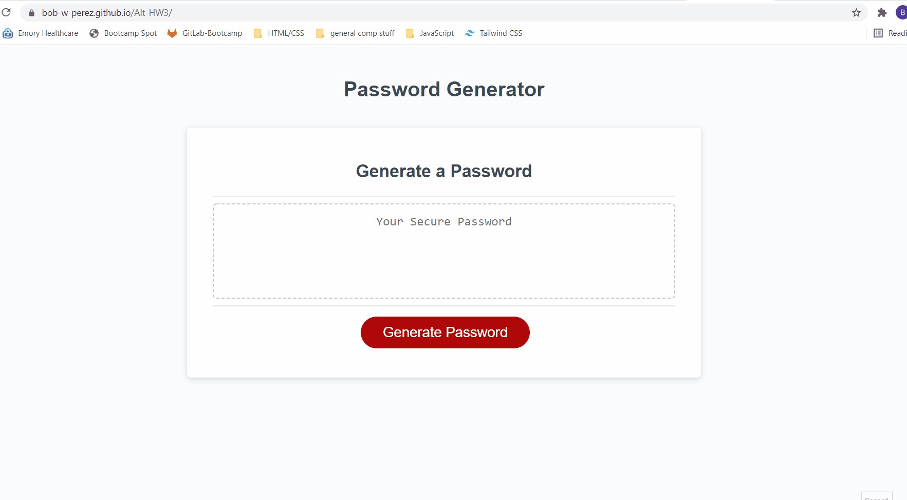

# Password-Generator-Homework-3

- This project was to make a a random password generator where the user can choose the criteria (length and which types of characters to use) and then have the program display the password. The design and layout was provided as base code; the project consisted of programming the functionality in JavaScript.
## Installation

No installation required.
Go to [https://bob-w-perez.github.io/Password-Generator-Homework-3/](https://bob-w-perez.github.io/Password-Generator-Homework-3/) to use the application.

The code and all relevant files can be found at [https://github.com/bob-w-perez/Password-Generator-Homework-3](https://github.com/bob-w-perez/Password-Generator-Homework-3). 

## Usage

## Features
- allows user to select any of the following character classes for their password: 

<html>

&nbsp;&nbsp;&nbsp;&nbsp;&nbsp;&nbsp;- lowercase letters

&nbsp;&nbsp;&nbsp;&nbsp;&nbsp;&nbsp;- uppercase letters

&nbsp;&nbsp;&nbsp;&nbsp;&nbsp;&nbsp;- numbers

&nbsp;&nbsp;&nbsp;&nbsp;&nbsp;&nbsp;- special characters

</html>
 
- password will ALWAYS have at least one character from each  selected class (this is accomplished via a recursive function that generates random passwords until one matches the selected criteria)
- password must be 8 to 128 characters in length, other inputs will prompt the user to retry
- optional *BONUS* feature allows user to make inputs via toggle selector instead of alert boxes (accessed at [https://bob-w-perez.github.io/Alt-HW3/](https://bob-w-perez.github.io/Alt-HW3/))

## Contributing
Solo project for GATech Coding Bootcamp

## License
MIT License

Copyright (c) 2021 Robert Perez

Permission is hereby granted, free of charge, to any person obtaining a copy
of this software and associated documentation files (the "Software"), to deal
in the Software without restriction, including without limitation the rights
to use, copy, modify, merge, publish, distribute, sublicense, and/or sell
copies of the Software, and to permit persons to whom the Software is
furnished to do so, subject to the following conditions:

The above copyright notice and this permission notice shall be included in all
copies or substantial portions of the Software.

THE SOFTWARE IS PROVIDED "AS IS", WITHOUT WARRANTY OF ANY KIND, EXPRESS OR
IMPLIED, INCLUDING BUT NOT LIMITED TO THE WARRANTIES OF MERCHANTABILITY,
FITNESS FOR A PARTICULAR PURPOSE AND NONINFRINGEMENT. IN NO EVENT SHALL THE
AUTHORS OR COPYRIGHT HOLDERS BE LIABLE FOR ANY CLAIM, DAMAGES OR OTHER
LIABILITY, WHETHER IN AN ACTION OF CONTRACT, TORT OR OTHERWISE, ARISING FROM,
OUT OF OR IN CONNECTION WITH THE SOFTWARE OR THE USE OR OTHER DEALINGS IN THE
SOFTWARE.